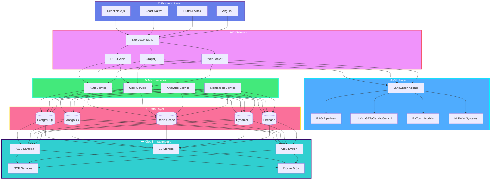
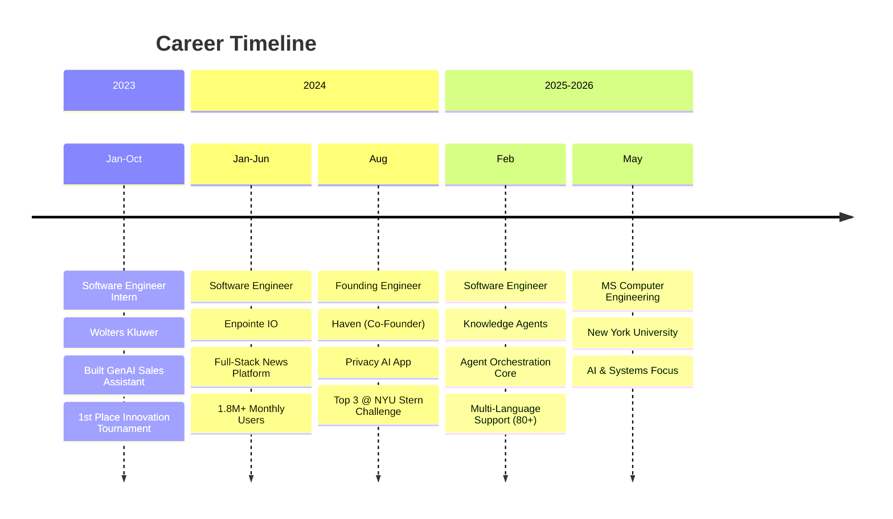
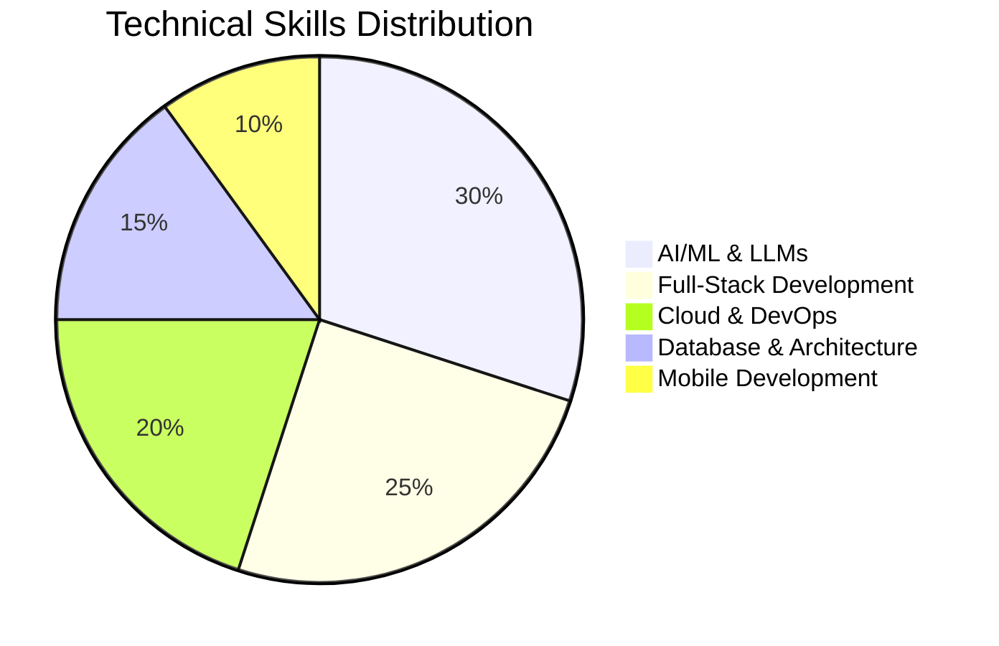

<div align="center">
  
  
  <br/>
  
  <a href="https://www.linkedin.com/in/amaanmithani/">
    
  </a>
  <a href="mailto:am14647@nyu.edu">
    
  </a>
  <a href="https://github.com/amaanmithani">
    
  </a>
  
  
  <br/><br/>
  
  
  
  <br/>
  
  
  
  
</div>

<br/>

## 🚀 About Me

```typescript
const amaanMithani = {
  title: "Software Engineer & AI Architect",
  education: "MS Computer Engineering @ NYU (May 2026)",
  location: "New York, NY 🗽",
  
  currentFocus: [
    "Agent-Orchestration Systems (LangGraph, MCP)",
    "Multi-Agent AI Pipelines with RAG",
    "Scalable Full-Stack Platforms (React, TypeScript, Express)",
    "Cloud-Native Architectures (AWS, GCP, Docker, Kubernetes)"
  ],
  
  achievements: {
    startups: "Co-founded Haven - Privacy-First AI App (300+ users, Top 3 @ NYU Stern Challenge)",
    research: "Published: Hybrid Optimization of NLP & Vision Transformers (10× size reduction)",
    hackathons: "1st Place @ Wolters Kluwer Innovation Tournament (600+ participants)",
    production: "Built systems serving 1.8M+ monthly users with 99.99% uptime"
  },
  
  philosophy: "Building AI systems that scale, platforms that perform, and products that matter."
};
```

<br/>

## 🏗️ Full-Stack Architecture



<br/>

## 💼 Professional Journey



<br/>

## 🛠️ Technology Stack

<div align="center">

### 💻 Languages & Core


### 🎨 Frontend Development


### ⚙️ Backend & APIs


### 🤖 AI & Machine Learning


### 💾 Databases & Storage


### ☁️ Cloud & DevOps


### 🔧 Tools & Platforms


</div>

<br/>

## 📊 Technical Expertise Distribution



<br/>

## 🎯 Featured Projects & Achievements

<div align="center">

### 🏆 Production Systems at Scale

</div>

#### 🤖 **Knowledge Agents** - Agent Orchestration Platform
**Software Engineer** | *Feb 2026 - Present*

- **Agent Core Architecture**: Designed and implemented the core agent-orchestration system using **LangGraph** and **MCP** (Model Context Protocol)
- **Multi-Language Support**: Built automated support system with source-cited responses across **80+ languages**
- **Advanced Pipeline**: Implemented stateful multi-step pipelines with persistent memory and rubric-based scoring layer enforcing structured JSON responses
- **Provider-Agnostic RAG**: Created unified RAG layer supporting **4 LLM backends** (Anthropic, OpenAI, Google, Azure) with single-config provider swapping
- **Performance Optimization**: Eliminated N+1 query bottlenecks through connection pooling and batch endpoints
- **Tech Stack**: LangGraph, M
